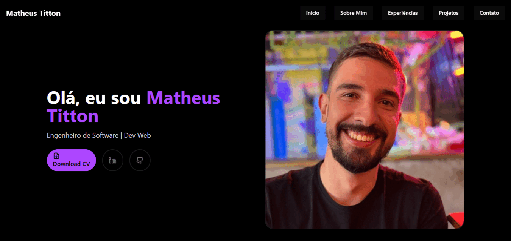

# Portfólio
Este repositório contém o código-fonte do meu portfólio pessoal, desenvolvido durante a disciplina de Laboratório de Projeto de Software, no 4º período do curso de Engenharia de Software da PUC Minas.

O site está organizado em quatro seções:

 1. 🏠 **Página Inicial -** Um pouco sobre mim, minha trajetória, principais objetivos e links para minhas redes profissionais.
 2. 💼 **Experiências -** Um panorama das empresas em que atuei.
 3. 📂 **Projetos -** Uma seleção de softwares e soluções que desenvolvi.
 4. 📫 **Contatos -** Meus canais diretos para comunicação.

---

# Tecnologias Utilizadas
O projeto foi construído com as seguintes tecnologias:

- **Next.Js -** Framework React fullstack com suporte a SSR e API routes.
- **Shadcn/ui -** Componentes estilizados com Tailwind CSS.
- **Tailwind -** Framework CSS utilitário para estilização rápida.
- **TypeScript -** Superset do JavaScript com tipagem estática.

---

# Protótipos

Para visualizar o protótipo do projeto [clique aqui](./images/Protótipo.png) 🚀

---

⚙️ Como rodar localmente

1. Clone o repositório:
git clone https://github.com/matheustitton/portifolioMatheus.git

2. Entre na pasta do projeto:
cd portifolio

3. Instale as dependências:
npm install

4. Rode o projeto em ambiente de desenvolvimento:
npm run dev

---

☁️ Deploy na Vercel
O projeto está hospedado na Vercel.
Acesse: 👉 https://portfolio-matheus-tau.vercel.app/

📳 Representação Gráfica:

---

📬 Contato
 - 📧 Email: seuemail@email.com
 - 💼 LinkedIn: linkedin.com/in/seu-usuario
 - 🐙 GitHub: github.com/seu-usuario

